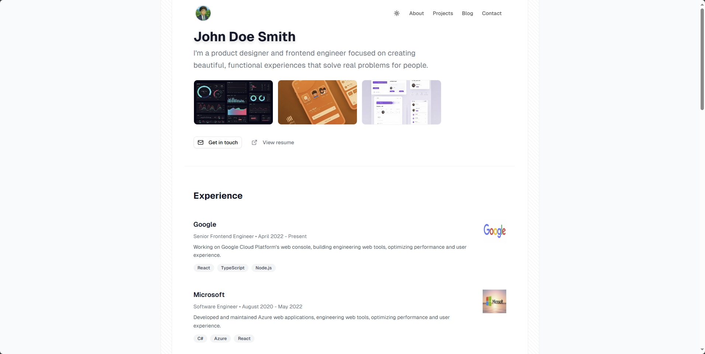

# Minimal Portfolio

A modern, responsive portfolio website built with Next.js and shadcn/ui components.

[](https://ef-portfolio03.vercel.app/)

## Features

- **Modern Design**: Clean, minimal interface with dark mode support
- **Responsive**: Optimized for all device sizes
- **Fast Performance**: Built with Next.js 15 and React 19
- **Component Library**: Complete shadcn/ui component system
- **TypeScript**: Full type safety throughout the application

## Tech Stack

- **Framework**: Next.js 15
- **Language**: TypeScript
- **Styling**: Tailwind CSS
- **Components**: shadcn/ui
- **Theme**: next-themes (dark/light mode)

## Getting Started

1. Clone the repository
```bash
git clone https://github.com/elijah-farrell/portfolio-tempalte03.git
```

2. Install dependencies
```bash
npm install
```

3. Run the development server
```bash
npm run dev
```

4. Open [http://localhost:3000](http://localhost:3000) in your browser

## Available Scripts

- `npm run dev` - Start development server
- `npm run build` - Build for production
- `npm run start` - Start production server
- `npm run lint` - Run ESLint

## License

MIT License
